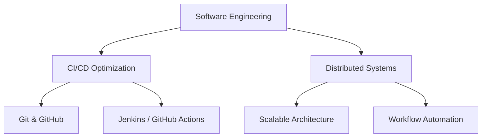

# Hi, I'm Brandon A. Calderon Morales 👋

**Software Engineer, Product-Minded Software Engineer**  
Omaha, Nebraska, United States  
[brandon-calderon-moralesportfolio.dev](https://brandon-calderon-moralesportfolio.dev) | [LinkedIn](https://www.linkedin.com/in/bcalderonmorales-cmoe) | brandon.ceemoe@gmail.com | [dev-environment:dockerhub](https://hub.docker.com/r/cmoe640/dev-environment)

---

## Summary

I bridge military precision with software innovation, bringing a distinctive approach to engineering challenges. My journey from Marine Corps Legal Chief to Software Engineer has shaped my philosophy: technical excellence isn't just about code—it's about strategic thinking, disciplined execution, and empowering others. Whether optimizing CI/CD pipelines, mentoring junior developers, or architecting distributed systems, I focus on building resilient, scalable solutions that integrate both human and technical factors. Passionate about democratizing development environments and streamlining workflows, I use my experience to create accessible, efficient open-source tools.

---

## Top Skills & Certifications

- **Team Leadership**
- **Spanish**
- **Teaching**
- **Certification:** Full-Stack Web Development Certificate

---

## Professional Timeline

Below is a visual representation of my career progression:

~~~mermaid
gantt
    dateFormat  YYYY-MM-DD
    title Career Timeline
    section Software Engineering
    Software Engineer, Sr. Professional (Fiserv) :active, f1, 2024-01-01, 1y4m
    Software Engineer (Leidos)                      :active, f2, 2021-10-01, 1y8m
    Web Services Developer (Insight Global)         :active, f3, 2023-05-01, 7m
    section Military & Legal
    Military Trainee, Sr. Professional (Fiserv)       :active, m1, 2023-11-01, 3m
    Legal Chief (US Marine Corps)                     :active, m2, 2018-06-01, 11m
    Court Reporter (US Marine Corps)                  :active, m3, 2016-08-01, 1y10m
    Legal Specialist (US Marine Corps)                :active, m4, 2014-12-01, 1y9m
    Legal Administrative Assistant (Boys Town)        :active, m5, 2019-06-01, 3m
~~~

---

## Skills & Expertise

**Technologies I work with:**

- **Languages:** C#, SQL, JavaScript, XML, YAML, Groovy  
- **Frameworks:** React, .NET 4.8 & .NET 6+  
- **Tools:** Visual Studio, VS Code, MSSQL, CyberArk, Splunk, Confluence, SharePoint, ServiceNow, Fortify SCA, Jenkins, GitHub Actions

---

## Experience Highlights

### Fiserv
- **Role:** Software Engineer, Sr. Professional  
- **Duration:** January 2024 - Present (1 year 2 months)  
- **Location:** Omaha, Nebraska, United States  
- **Highlights:**
  - Spearheaded migration from Jenkins to GitHub Actions to optimize CI/CD workflows.
  - Resolved critical CI/CD issues and standardized workflows to boost team efficiency.
  - Mentored junior engineers and contributed to high-level design and user story creation.

### Fiserv (Military Trainee, Sr. Professional)
- **Duration:** November 2023 - January 2024 (3 months)  
- **Location:** Omaha, Nebraska, United States  
- **Highlights:**
  - Gained insights into project management and business analysis as part of a specialized training program.
  - Enhanced soft skills including communication, teamwork, and leadership.

### Insight Global
- **Role:** Web Services Developer  
- **Duration:** May 2023 - November 2023 (7 months)  
- **Location:** Bellevue, Nebraska, United States  
- **Highlights:**
  - Developed and maintained web services using C#, SQL, and JavaScript.
  - Managed design, implementation, refactoring, and bug fixes within a legacy codebase.

### Leidos
- **Role:** Software Engineer  
- **Duration:** October 2021 - May 2023 (1 year 8 months)  
- **Location:** Omaha, Nebraska, United States  
- **Highlights:**
  - Worked as both a Frontend and DevOps engineer.
  - Configured development environments using Linux, VS Code, and Vim.
  - Built and maintained shared React components and contributed to agile workflows.

### Boys Town National Research Hospital
- **Role:** Legal Administrative Assistant  
- **Duration:** June 2019 - August 2019 (3 months)  
- **Location:** Boys Town, Nebraska

### United States Marine Corps
- **Roles:**
  - **Legal Chief:** June 2018 - April 2019 (11 months) – Morón De La Frontera, Andalusia, Spain
  - **Court Reporter:** August 2016 - May 2018 (1 year 10 months) – Camp Lejeune, North Carolina
  - **Legal Specialist:** December 2014 - August 2016 (1 year 9 months) – Camp Lejeune, North Carolina

---

## Education

- **University of Nebraska at Omaha**  
  Bachelor's Degree in Multidisciplinary Studies (Computer Science Concentration)  
  *August 2013 - May 2025*
- **devCodeCamp**  
  Certificate, Full-Stack Software Development  
  *May 2021 - August 2021*
- **Omaha South Magnet High School**  
  High School Diploma  
  *2009 - 2013*

---

## Connect with Me

Feel free to reach out for mentorship, collaboration, or innovative project discussions:  
[brandon.ceemoe@gmail.com](mailto:brandon.ceemoe@gmail.com) | [LinkedIn](https://www.linkedin.com/in/bcalderonmorales-cmoe)

*Thank you for visiting my profile!*
