# Personal Interests

Beyond software engineering, I have a diverse range of interests that shape who I am and influence my creative approach to problem-solving.

## 📚 Reading

Reading keeps my mind sharp and provides new perspectives. I enjoy a variety of genres including:

- Technical books on software engineering
- Leadership and personal development
- Science fiction and fantasy

## 🎵 Music

Music is an essential part of my life, with tastes spanning across multiple genres:

### Genres I Enjoy

| Genre | What I Appreciate |
| ----- | ----------------- |
| Rap & Hip-Hop | Lyrical complexity and storytelling |
| Classical | Structure and emotional depth |
| Spanish Guitar | Technical skill and cultural richness |
| Mexican Music | Cultural connection (Mariachi, Ranchera, Norteña, Corridos) |
| Electronic | Innovation in Dubstep and Techno |

## 📺 Anime

Anime provides both entertainment and surprising insights into storytelling and character development:

```mermaid
graph TD
    A[My Anime Universe] --> B[Dragon Ball Saga]
    A --> C[Battle Shonen]
    A --> D[Psychological & Dark]
    
    B --> B1[Dragon Ball]
    B --> B2[Dragon Ball Z]
    B --> B3[Dragon Ball Super]
    B --> B4[Dragon Ball GT]
    B --> B5[Dragon Ball Daima]
    
    C --> C1[One Punch Man]
    C --> C2[Solo Leveling]
    C --> C3[Demon Slayer]
    C --> C4[One Piece]
    C --> C5[Attack on Titan]
    C --> C6[Kaiju No. 8]
    
    C3 --> C3a[Beautiful Animation]
    C3 --> C3b[Compelling Characters]
    
    C4 --> C4a[Epic Worldbuilding]
    C4 --> C4b[Character Growth]
    
    C5 --> C5a[Complex Narrative]
    C5 --> C5b[Dark Themes]
    
    D --> D1[Death Note]
    D --> D2[Monster]
    D --> D3[Berserk]
    
    D1 --> D1a[Cat and Mouse Thriller]
    D1 --> D1b[Moral Questions]
    
    D2 --> D2a[Psychological Depth]
    D2 --> D2b[Masterful Storytelling]
    
    D3 --> D3a[Dark Fantasy]
    D3 --> D3b[Incredible Art]
    
    style A fill:#6d4c9c,stroke:#333,stroke-width:4px,color:#fff
    style B fill:#3a7ca5,stroke:#333,stroke-width:2px,color:#fff
    style C fill:#3a7ca5,stroke:#333,stroke-width:2px,color:#fff
    style D fill:#3a7ca5,stroke:#333,stroke-width:2px,color:#fff
```

The variety of anime I enjoy reflects my interest in both action-packed entertainment and deeply complex narratives that challenge conventional thinking.

## 🎸 Guitar

While I'm an appreciator rather than a player, Spanish guitar music represents the perfect blend of technical skill and emotional expression. I admire artists who can tell stories through their instruments.

## 🎮 Gaming

As a gaming generalist, I appreciate many different genres and platforms. Games provide not just entertainment but often valuable lessons in:

- Strategic thinking
- Resource management
- Storytelling
- Problem-solving under pressure

## 👨‍👧‍👧 Parenting

Father to two wonderful daughters, I'm constantly learning and growing in this most important role:

- Developing effective communication strategies
- Finding the balance between guidance and independence
- Creating meaningful family traditions
- Learning from other parents' experiences

## 🧠 Wisdom & Leadership

I'm passionate about developing as a leader and gaining wisdom through:

- Reading classic and modern philosophy
- Studying leadership principles from diverse sources
- Learning tactical approaches to complex problems
- Understanding human psychology and communication
- Applying military discipline and precision to civilian life

---

*These diverse interests inform my approach to software engineering, bringing unique perspectives and creative solutions to technical challenges.*